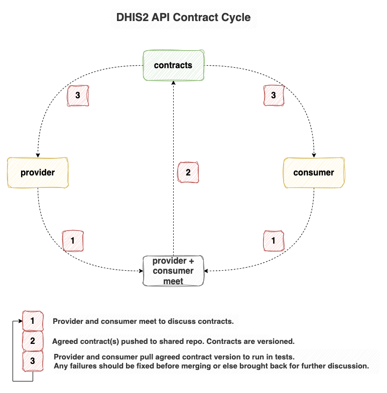

# dhis2-api-contracts

POC to see how a shared repo for API contracts might look and work.  

## Cycle


## About
The project has 3 main directories: 
- contracts
  - this is where the shared contracts live
- backend
  - any backend specific code to be able to retrieve the assets as a dependency
  - contains a minimal `pom.xml` that includes the root contracts in the packaging of resources
- frontend
  - any frontend specific code to be able to retrieve the assets as a dependency (if needed)

The project is published as a GitHub release. Backend projects can add the contracts as a dependency using JitPack. e.g. 
```xml
<repositoryies>
  <repository>
    <id>jitpack.io</id>
    <url>https://jitpack.io</url>
  </repository>
</repositoryies>

<dependencies>
  <dependency>
    <groupId>com.github.david-mackessy</groupId>
    <artifactId>dhis2-api-contracts</artifactId>
    <version>3.0.0</version>
  </dependency>
</dependencies>

```

The POC includes sample contracts and JSON schemas for `Category` & `CategoryOption` to start.

## Goals
Some brief info about the main goals of this setup: 
- Use tools we already have in our ecosystem [GitHub, Maven, JitPack, JUnit]
  - from the backend point of view, no new tool/tech is required
  - it's free
  - easily integrated into existing project
- Enable running tests without requiring network calls
  - Ideally we'd like to run tests without having to make network calls to get the contracts
  - With the GitHub release approach, we can release an artefact and allow dependency management tools to package them in projects, ready to use in tests
- Defining our own contracts & how they would work best for us
  - We have the flexibility to define what we want
  - Aim to keep them simple while still providing value
- Use the existing OpenAPI spec in DHIS2 to generate initial JSON schemas
  - starter schemas can be easily generated using the current DHIS2 OpenAPI spec
  - e.g. the following command calls the DHIS2 Play dev instance openapi endpoint to generate the `Category` schema
  ```text
  curl https://play.im.dhis2.org/dev/api/openapi/openapi.json \
  -u "system:System123" \
  | jq '.components.schemas.Category' \
  | jq '. + {"$schema": "https://json-schema.org/draft/2020-12/schema", "$id": "https://dhis2.org/Category.schema.json", title: "Category JSON Schema"}' \
  > ~/category-json-schema.json
  ```