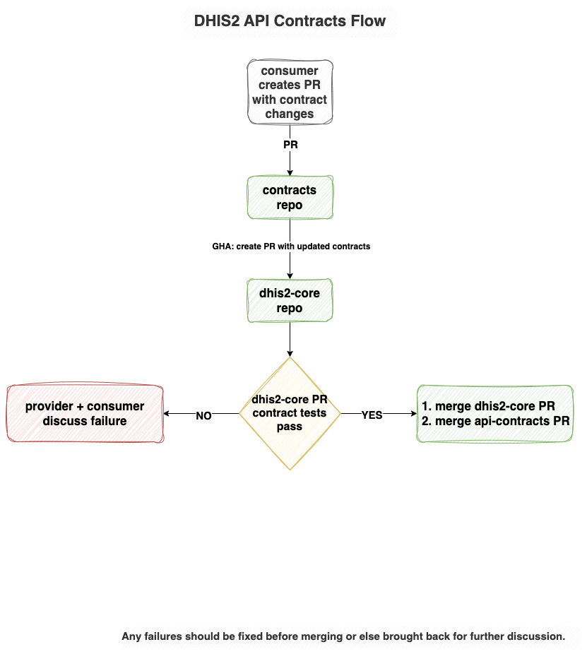

# dhis2-api-contracts

POC to see how a shared repo for API contracts might look and work.  

## Flow


## About
The project has a contracts directory, this is where the shared contracts live. 
The repo uses a GitHub Action on every pull request, to sync updated contracts to the dhis2-core repo (creating a PR with the updated contracts).

The POC includes sample contracts and JSON schemas for `Category` & `CategoryOption` to start.

## Goals
Some brief info about the main goals of this setup: 
- Use tools we already have in our ecosystem [GitHub, JUnit]
  - from the backend point of view, no new tool/tech is required
  - it's free
  - easily integrated into existing project
- Enable running tests without requiring network calls
  - Ideally we'd like to run tests without having to make network calls to get the contracts
  - With the GitHub sync PR approach, we can sync updated contracts to dhis2-core so they are ready to use in tests
- Defining our own contracts & how they would work best for us
  - We have the flexibility to define what we want
  - Aim to keep them simple while still providing value
- Use the existing OpenAPI spec in DHIS2 to generate initial JSON schemas
  - starter schemas can be easily generated using the current DHIS2 OpenAPI spec
  - e.g. the following command calls the DHIS2 Play dev instance openapi endpoint to generate the `Category` schema
  ```text
  curl https://play.im.dhis2.org/dev/api/openapi/openapi.json \
  -u "system:System123" \
  | jq '.components.schemas.Category' \
  | jq '. + {"$schema": "https://json-schema.org/draft/2020-12/schema", "$id": "https://dhis2.org/Category.schema.json", title: "Category JSON Schema"}' \
  > ~/category-json-schema.json
  ```
